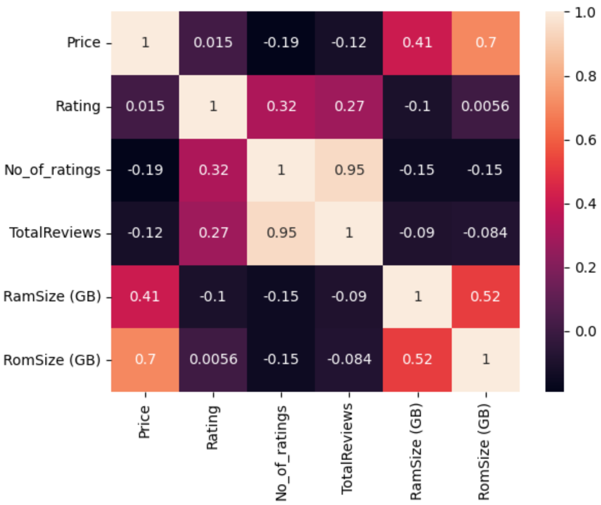
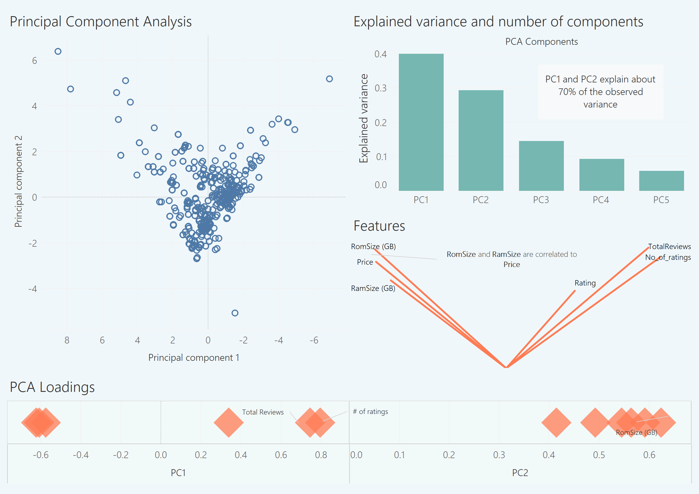

```{r}
#knitr::opts_chunk$set(echo = TRUE)
library(survey) #Used for statistical analysis
library(sampling) #Used for sample data
library(MASS) #USed for QDA
library(klaR) #Used for partimat
library(tree) #used for the tree model
library(VGAM) #Used for Multinominal Regression model
library(caret) #Used for creating folds
library(ggplot2) #Used for plot
library(tibble) #used for nice display dataframe
library(magrittr) #Used for %>% 
library(tidyverse) #Used to manipualte dataframe
library(dplyr) # Used for easy manipualte rows and columns
library(plyr) #Used for mapping vector values
library(stringr) #Used to manipulate string
library(gridExtra) #Used to arrange the ggplot chart
library(rpart) #Used for classification tree
library(rpart.plot) #Used for plotting classification tree
```


\pagebreak

# Introduction

Mobile phones are everywhere, so are the prices. Despite still having the word "phone" in the name, a typical modern smartphone has much more features than just to make and receive calls. They are boasting a staggering range of applications like brand, memory, storage, camera, resolution, just to name a few. All these cutting edge technology and features packed in one little device does not come without a cost. A [2020 review](https://www.thisismoney.co.uk/money/bills/article-8548235/High-end-mobile-phones-price-soared-490-20-years.html) of premium mobile phones shows a staggering _490%_ rise in the last two decades.

With so many mobile phones on the market, it can be difficult to decide which one you want to buy. As a customer, we are particularly interested in finding some relation between all these features and its selling price. To this purpose, we collected the [MobilePhone's dataset](https://www.kaggle.com/datasets/sudhanshuy17/mobilephone) from Kaggle and apply a set of statistical analysis hoping to answer some guiding questions:

1. Can we estimate the average price for mobile phones?
2. What is the impact of each mobile phone's feature on the selling price?
3. Can a classification model to distinguish the selling price range?
3. Can we build a decent model to predict the selling price for a mobile phone?


# Dataset and Cleanup

The initial dataset consists of 8 columns and 28,036 rows and no missing values. These 8 columns are:

* **Model**: categorical variables with sub-classes. These names include the color of the unit
and its storage capacity. The latter being also listed as a separate column. - **Independent Variable**
* **Company**: categorical variable. Name of the phone's manufacturer. - **Independent Variable**
* **Price**: continuous variable. Units in Indian Rupees. - **Dependent Variable**
* **Rating**: continuous variable. - **Independent Variable**
* **Number of ratings**: discrete variable: a simple count. - **Independent Variable**
* **Total reviews**: discrete variable: a simple count. - **Independent Variable**
* **RAM size**: categorical variable. RAM specification of the phone. - **Independent Variable**
* **ROM size**: categorical variable. Storage (non-volatile memory) capacity of the phone. - **Independent Variable**

Some initial steps can be completed to clean the dataset and create new variables which can be used in our analysis. The initial steps for cleaning the dataset are as follows:

1. Remove any duplicates in the dataset;
2. Because **Model** column contains sub-class of a mobile phone, we decide to further break it down to _Model_ and _Color_;
3. Convert all units from **RAM size** and **ROM size** measure to GB and then remove unit suffix;
4. Add additional column to segment the **Price** into 4 different levels;
5. Add additional column to determine if a phone has %G feature or not based on **Model** information.

```{r Cleanup, results='hold'}
mobile_dataset <- read.csv("./Updated_Mobile_Dataset.csv")
#Step 0: convert Model and Company letter to uppercase.
mobile_dataset$Model <- toupper(mobile_dataset$Model)
mobile_dataset$Company <- toupper(mobile_dataset$Company)
#Break down Model column into Model only and Color columns
#Step 1: remove the Company name from Model
Model_no_Company <- stringr::str_remove(mobile_dataset$Model,mobile_dataset$Company) %>% trimws(., which = c("both"))
#Step 2: remove anything after parentheses to get Model only info
mobile_dataset$Model_Only <- stringr::str_replace(Model_no_Company, " \\s*\\([^\\)]+\\)", "")
#Step 3: Get the color information from inside the last ()
#Step 3.1: Get the parenthesis and what is inside from the last ()
Model_no_Company_parenthesis <- stringr::str_extract(Model_no_Company, "(?<=\\()([^()]*?)(?=\\)[^()]*$)")
#step 3.2: Get the color by just retaining the info before ,
mobile_dataset$Color <- gsub(",.*$", "", Model_no_Company_parenthesis)
#Step 4: Remove duplicated rows in the dataset
mobile_dataset <- mobile_dataset[!duplicated(mobile_dataset),]
#Step 5: cut the price based on the percentile into 4 different levels
mobile_dataset <- mobile_dataset %>% mutate(Price_Level = ntile(Price, n = 4))
#Step 5.1: map each number level to the character
from <- c(1,2,3,4)
to <- c("Low", "Medium", "High", "Very High")
mobile_dataset$Price_Level <- mapvalues(mobile_dataset$Price_Level, from = from, to = to)
#Step 6: Get the numeric part of RomSize (remove GB and MB, but convert MB to GB), discard any record that no numeric in RomSize
#Step 6.1: there are some data input errors for RamSize and RomSize. In the records where RomSize is "Not Known" are swapped with RamSize, so we need to correct that.
RamSize_temp <- ifelse(mobile_dataset$RomSize == "Not Known", "0 GB", mobile_dataset$RamSize)
mobile_dataset$RomSize <- ifelse(mobile_dataset$RomSize == "Not Known", mobile_dataset$RamSize, mobile_dataset$RomSize)
mobile_dataset$RamSize <- RamSize_temp
#Step 6.2: split RomSize into two columns with size number and unit, and convert MB to 1/1000GB, KB to 1/1000000GB
mobile_dataset$RamSize_Ori <- mobile_dataset$RamSize
mobile_dataset$RomSize_Ori <- mobile_dataset$RomSize
mobile_dataset <- mobile_dataset %>% separate(RomSize, c("RomSize_num", "RomSize_Unit")) %>% mutate(RomSize_Unit= mapvalues(.$RomSize_Unit, from = c("GB", "MB", "KB"), to = c(1, 1/1000, 1/1000000)))
#step 6.3: remove any rows that are not numeric value for RomSize
mobile_dataset <- mobile_dataset[!is.na(as.numeric(mobile_dataset$RomSize_num)),]
mobile_dataset$RomSize_num <- as.numeric(mobile_dataset$RomSize_num)
mobile_dataset$RomSize_Unit <- ifelse(is.na(as.numeric(mobile_dataset$RomSize_Unit)), 0, as.numeric(mobile_dataset$RomSize_Unit))
#Step 6.4: generate the final column RomSize_inGB
mobile_dataset$RomSize_inGB <- mobile_dataset$RomSize_num * mobile_dataset$RomSize_Unit
#Step 7: Get the numeric part of RamSize (remove GB and MB, but convert MB to GB), discard any record that no numeric in RamSize
#Step 7.1: split RamSize into two columns with size number and unit, and convert MB to 1/1000GB
mobile_dataset <- mobile_dataset %>% separate(RamSize, c("RamSize_num", "RamSize_Unit")) %>% mutate(RamSize_Unit= mapvalues(.$RamSize_Unit, from = c("GB", "MB"), to = c(1, 1/1000)))
#step 7.2: remove any rows that are not numeric value for RamSize
mobile_dataset <- mobile_dataset[!is.na(as.numeric(mobile_dataset$RamSize_num)),]
mobile_dataset$RamSize_num<- as.numeric(mobile_dataset$RamSize_num)
mobile_dataset$RamSize_Unit <- as.numeric(mobile_dataset$RamSize_Unit)
#Step 7.3: generate the final column RamSize_inGB
mobile_dataset$RamSize_inGB <- mobile_dataset$RamSize_num * mobile_dataset$RamSize_Unit
#Step 8: Create a new column to determine if the phone is 5G or not
mobile_dataset$Is_5G <- ifelse(str_detect(mobile_dataset$Model_Only, "5G"), "Yes", "No")
#Step 9: only keep the columns we need
column_names <- c("Model", "Company", "Price", "Rating", "No_of_ratings", "TotalReviwes", "Model_Only", "Color", "Price_Level", "RamSize_inGB", "RomSize_inGB", "RamSize_Ori", "RomSize_Ori", "Is_5G" )
mobile_dataset <- mobile_dataset[column_names]
# #Step 9: final check up. Convert all company name to uppercase and then do a final duplicated removal
# mobile_dataset$Company <- toupper(mobile_dataset$Company)
# mobile_dataset <- mobile_dataset[!duplicated(mobile_dataset),]
write.csv(mobile_dataset, file = './Cleaned_Mobile_Dataset.csv', row.names = F)
```

After cleaning and breaking down columns, the dataset now consists of 14 columns and 725 rows and no missing values. These 14 columns are:

* **Model**: categorical variables with sub-classes. These names include the color of the unit
and its storage capacity. The latter being also listed as a separate column. - **Independent Variable**
* **Company**: categorical variable. Name of the phone's manufacturer. - **Independent Variable**
* **Price**: continuous variable. Units in Indian Rupees. - **Dependent Variable**
* **Rating**: continuous variable. - **Independent Variable**
* **Number of ratings**: discrete variable: a simple count. - **Independent Variable**
* **Total reviews**: discrete variable: a simple count. - **Independent Variable**
* **Model_Only**: categorical variable: only contains the model information of a mobile phone. - **Independent Variable**
* **Color**: categorical variable: color of a mobile phone. - **Independent Variable**
* **Price_Level**: The price level of a mobile phone, with levels of "Low", "Medium", "High", "Very High". - **Independent Variable**
* **RamSize_inGB**: continuous variable. RAM specification of the phone in GB. - **Independent Variable**
* **RomSize_inGB**: continuous variable. Storage (non-volatile memory) capacity of the phone in GB. - **Independent Variable**
* **RamSize_Ori**: categorical variable. RAM specification of the phone, original information. - **Independent Variable**
* **RomSize_Ori**: categorical variable. Storage (non-volatile memory) capacity of the phone, original information. - **Independent Variable**
* **Is_5G**: categorical variable. If the phone has 5G service or not. - **Independent Variable**

```{r Load Data, results='hold'}
#mobile_dataset <- as_tibble(read.csv("./Cleaned_Mobile_Dataset.csv"))
#Specify the level for Price_Level column
mobile_dataset$Price_Level <- factor(mobile_dataset$Price_Level, levels = c("Low", "Medium", "High", "Very High"))
head(mobile_dataset, 4)
```
**Table 1**: The cleaned-up dataset for Mobile Phone

The dataset and detailed analysis can be found at this [repository](https://github.com/YongpengFu/Statistical-Model-for-Mobile-Phones). 

# Scope of Analysis

Our team is finalizing what the full analysis of the dataset will look like, but a preliminary template and breakdown of work by team member has been included below. The different colors represent which components of the project different team members would take on. It is anticipated that all members will assist in the finalization of the report.


\pagebreak

#  Chapter 1: Exploratory Data Analysis
## 1.1: A summary of the dataset
The dimension of the cleaned dataset is 726 rows and 14 columns. A summary of the data is as follows:
```{r 1.1 Summary, results='hold'}
mobile_dataset <- as_tibble(read.csv("./Cleaned_Mobile_Dataset.csv"))
#Specify the level for Price_Level column
mobile_dataset$Price_Level <- factor(mobile_dataset$Price_Level, levels = c("Low", "Medium", "High", "Very High"))
mobile_dataset %>% summary()
```
**Table 2**: A summary for Mobile Phone dataset

## 1.2: Exploratory Data Analysis
This section is focused on the exploration of relation between variables using various visualization techniques.

The main target is Price in the dataset. In the following visualization it shows the distribution of Mobile Phone price with long tail towards to the high end. The average price is 15902 Rupees. Most price falls in the range of 50000 Rupees. One really stands out price range (arrow indicated) is 1000-2000 Rupees with the highest frequency.
```{r 1.2.1, fig.height=6, fig.width=12, results='hold'}
ggplot(data = mobile_dataset, mapping = aes(x=Price)) + geom_histogram(color="black", fill="white", bins = 100)+
  geom_vline(aes(xintercept=mean(Price)),
            color="blue", linetype="dashed", size=0.4) + geom_label(
    label="Mean Price = 15902", 
    x= mean(mobile_dataset$Price) + 10000,
    y=100,
    label.padding = unit(0.35, "lines"),
    label.size = 0.25,
    color = "black",
    fill="#69b3a2"
  ) +  geom_segment(aes(x = -5000, y = 140, xend = 0, yend = 130),lineend = "round",linejoin = "round",
                  arrow = arrow(length = unit(0.5, "cm"))) + labs(y="Count", x="Price in Rupees", 
       subtitle="Distribution of Mobile Phone price")
```


The following figure is to break down the Price by different phone-making companies. There are a total of 37 companies in the dataset. Iin consistent with previous figure about Price distribution, we see a big portion of Price falls between 9000 (left dash line) and 40000 (right dash line) Rupees. _Apple_ alone contributes the most of high priced Mobile Phones, while companies like from _NOKIA_ to _GFIVE_ contribute to the low-priced ones.
```{r 1.2.2,fig.height=6, fig.width=12, results='hold'}
ggplot(data = mobile_dataset, mapping = aes(y = reorder(Company, Price), x = Price)) +geom_boxplot()+ geom_line() +
    sapply(c(6499, 12490, 20000), function(xint) geom_vline(aes(xintercept = xint), color="blue", linetype="dashed", size=0.4)) + labs(y="Company", x="Price in Rupees", 
       subtitle="Boxplot for Mobile Phone price from different companies")
```

The Price is further broken down by their 5G services. Interestingly, neither high-priced nor low-priced Mobile Phones have equipped 5G service. In contrast, almost all middle-priced Mobile Phones have 5G service. Price for those with 5G service are slightly more expensive than those without. NOTE: the dashed line indicates the price between 9000 (left dash line) and 40000 (right dash line) Rupees.

```{r 1.2.3, fig.height=6, fig.width=12, results='hold'}
ggplot(data = mobile_dataset, mapping = aes(y = reorder(Company, Price), x = Price, color = Is_5G)) +geom_boxplot(position=position_dodge(width = 0.8))+ geom_line() +
    sapply(c(9000, 40000), function(xint) geom_vline(aes(xintercept = xint), color="blue", linetype="dashed", size=0.4)) + labs(y="Company", x="Price in Rupees", 
       subtitle="Boxplot for Mobile Phone price from different companies with 5G service (No / Yes)") + facet_wrap(~Is_5G)
```
The pattern is more obvious when we provide color for 4 different price level ("Low", "Medium", "High", "Very High"). Although mobile phones from companies like APPLE, GOOGLE, ASUS and NOTHING have no 5G service, their price are all very high. It is worth investigating if some other attributes like brand effect, Storage capacity (Rom Size), and calculation power (Ram Size) are playing roles. Most Mobile Phones (except MI) with 5G service, again, have a higher proportion falling in a Very High price level, compared to the counterparts without 5G service. Almost all the rest mobile phones without 5G service fall in a Low price level.

```{r 1.2.4, fig.height=6, fig.width=12, results='hold'}
ggplot(data = mobile_dataset,mapping = aes(y =reorder(Company, Price), fill = Price_Level)) + geom_bar(stat = "count", position="fill") + labs(y="Company", x="Percentage", 
       subtitle="Percent Boxplot for Mobile Phone price from different companies with 5G service (No / Yes)") + facet_wrap(~Is_5G)
```

Next, we explored some quantitative features with respect to the Mobile Phone price. The first scatter plot shows an obvious positive relation between Rating and Price as the smooth line indicates. The higher the Rating, the higher the Price. And this holds when we remove those bottom left 2 outlier data points. 
```{r 1.2.5, fig.height=6, fig.width=12, results='hold'}
#The first plot is one with outlier
plot1 = ggplot(data = mobile_dataset,mapping = aes(x = Rating, y = Price)) + geom_point(alpha=0.3) + geom_smooth(se=T) + 
  geom_segment(aes(x = 2.6, y = 20000, xend = 2.67, yend = 10000),lineend = "round",linejoin = "round",arrow = arrow(length = unit(0.5, "cm"))) +   
  geom_point(data=mobile_dataset[mobile_dataset$Rating<3.0,], aes(x = Rating, y = Price), color='red') +
  labs(y="Price in Rupees", x="Rating", subtitle="Relation between rating and price")

#The first plot is a one with outliers removed
plot2 = ggplot(data = mobile_dataset[mobile_dataset$Rating>3.0, ],mapping = aes(x = Rating, y = Price)) + geom_point(alpha=0.3) + geom_smooth(se=T) +
  labs(y="Price in Rupees", x="Rating", subtitle="Relation between rating and price after removing \nbottom left 2 outliers")

grid.arrange(plot1, plot2, ncol=2)
```

The second scatter plot as follows shows the relation between Total number of rating and Price. As the smooth line indicates, there is no obvious correlation between them. The result holds even when we remove some seemingly outliers on the far right end.
```{r 1.2.6, fig.height=6, fig.width=12, results='hold'}
ggplot(data = mobile_dataset,mapping = aes(x = No_of_ratings, y = Price)) + geom_point(alpha=0.3) + geom_smooth()+ labs(y="Price in Rupees", x="Total number of rating", subtitle="Relation between total nubmer of rating and price")
```
The same pattern is also observed in the third scatter plot where relation between Total number of reviews and Price is plotted. As the smooth line indicates, there is no obvious correlation between them. The result holds even when we remove some seemingly outliers on the far right end.
```{r 1.2.7, fig.height=6, fig.width=12, results='hold'}
ggplot(data = mobile_dataset,mapping = aes(x = TotalReviwes, y = Price)) + geom_point(alpha=0.3) + geom_smooth()+ labs(y="Price in Rupees", x="Total number of reviews", subtitle="Relation between total nubmer of reviews and price")
```
In the fourth scatter plot, below, there seems a slight positive relation between Ram size (in GB) and the Price. Ram is normally associated with speed and performance of an operating system. The higher ram is, the better it is in speed and performance. It makes sense that a mobile phone with a larger Ram will charge more. However, because nowadays most mobile phones are very fast and stable, people wont tell too much difference, making the added on value from ram is only weekly associated with price.
```{r 1.2.8, fig.height=6, fig.width=12, results='hold'}
plot1 = ggplot(data = mobile_dataset,mapping = aes(x = RamSize_inGB, y = Price)) + geom_point(alpha=0.3) + geom_smooth(se=T)+ labs(y="Price in Rupees", x="Ram Size in GB", subtitle="Relation between Ram size (in GB) and price")

plot2 = ggplot(data = mobile_dataset,mapping = aes(x = RomSize_inGB, y = Price)) + geom_point(alpha=0.3) + geom_smooth(se=T, method = lm)+ 
  geom_segment(aes(x = 490, y = 100000, xend = 500, yend = 90000),lineend = "round",linejoin = "round",arrow = arrow(length = unit(0.5, "cm"))) +   
  geom_point(data=mobile_dataset[mobile_dataset$RomSize_inGB>400,], aes(x = RomSize_inGB, y = Price), color='red') +
  labs(y="Price in Rupees", x="Rom Size in GB", subtitle="Relation between Rom size (in GB) and price")

grid.arrange(plot1, plot2, ncol=2)
```
In the final scatter plot, again, we have two charts, one the original dataset, the other with outlier removed. Both cases tells the same story. In contrast to the previous scatter plot (Ram size (in GB) and the Price), there is a very obvious positive linear relation between Rom size (in GB) and the Price. This makes sense because often times a mobile phone is more limited by its non-volatile memory space than its speed & performance.
```{r 1.2.9, fig.height=6, fig.width=12, results='hold'}
#The first plot is a one with outliers
plot1 = ggplot(data = mobile_dataset,mapping = aes(x = RomSize_inGB, y = Price)) + geom_point(alpha=0.3) + geom_smooth(se=T, method = lm)+ 
  geom_segment(aes(x = 490, y = 100000, xend = 500, yend = 90000),lineend = "round",linejoin = "round",arrow = arrow(length = unit(0.5, "cm"))) +   
  geom_point(data=mobile_dataset[mobile_dataset$RomSize_inGB>400,], aes(x = RomSize_inGB, y = Price), color='red') +
  labs(y="Price in Rupees", x="Rom Size in GB", subtitle="Relation between Rom size (in GB) and price")

#The second plot is a one with outliers removed
plot2 = ggplot(data = mobile_dataset[mobile_dataset$RomSize_inGB<400, ],mapping = aes(x = RomSize_inGB, y = Price)) + geom_point(alpha=0.3) + geom_smooth(se=T,method = lm) +
  labs(y="Price in Rupees", x="Rom Size in GB", subtitle="Relation between Rom size (in GB) and price")

grid.arrange(plot1, plot2, ncol=2)
```

\pagebreak

#  Chapter 2: Statistical Data Analysis
## 2.1: Prediction of Mobile Phone Price Level
In this section, we will use a range of statistical models to predict mobile phone price level: "Low", "Medium", "High", "Very High" based on some selected features.

- Linear Discriminant Analysis (LDA)
- Quadratic Discriminant Analysis (QDA)
- Decision Tree (Classification)
- Multinomial Regression

First, let use explore the distribution for difference price level. From the following bar plot, you can see it is very close to uniformly distributed across the dataset. Balanced dataset is important for us when we do the classification.
```{r 5.1,fig.height=4, fig.width=10, results='hold'}
price_level_count <- table(mobile_dataset$Price_Level) %>% as.data.frame()
ggplot(data = price_level_count, mapping = aes(x = Var1, y = Freq)) + geom_bar(stat = "identity") + 
  labs(y="Price Level", x="Count", subtitle="Count for different Price Level")
```
### 2.1.1 Quadratic Discriminant Analysis (LDA)
We want to use LDA to classify our observations into mobile phone price level: "Low", "Medium", "High", "Very High". However, we know LDA has 2 assumptions:

- The distribution of the predictors is normally distributed within each group.
- The homogeneity of variance-covariance matrices 

Based on EDA in section 4.2, we know three **numeric features** have a great impact on price level a mobile phone belongs to, which are _Rating_, _RamSize_inGB_ and _RomSize_inGB_. As such, we will do a test for normal distribution for each predictor in each price level. Because we have 4 different price levels and 3 variables, the resulting normality check would be 4*3 = 12 comparison. We use Q-Q plot and Shapiro test for normality check.
```{r 2.1.1.1, fig.height=3, fig.width=12, results='hold'}
#split the dataset based on the price level
mobile_dataset_low <- mobile_dataset[mobile_dataset$Price_Level == "Low", ]
mobile_dataset_medium <- mobile_dataset[mobile_dataset$Price_Level == "Medium", ]
mobile_dataset_high <- mobile_dataset[mobile_dataset$Price_Level == "High", ]
mobile_dataset_very_high <- mobile_dataset[mobile_dataset$Price_Level == "Very High", ]
#generate the QQ plot for each price level
variables <- c("Rating", "RamSize_inGB", "RomSize_inGB")
par(mfrow = c(1,3))
for (i in variables){
  qqnorm(mobile_dataset_low[[i]], main = paste("Price Level LOW, Normal Q-Q Plot for", i))
  qqline(mobile_dataset_low[[i]], col = 3)
}
par(mfrow = c(1,3))
for (i in variables){
  qqnorm(mobile_dataset_medium[[i]], main = paste("Price Level Medium, Normal Q-Q Plot for", i))
  qqline(mobile_dataset_medium[[i]], col = 3)
}
par(mfrow = c(1,3))
for (i in variables){
  qqnorm(mobile_dataset_high[[i]], main = paste("Price Level High, Normal Q-Q Plot for", i))
  qqline(mobile_dataset_high[[i]], col = 3)
}
par(mfrow = c(1,3))
for (i in variables){
  qqnorm(mobile_dataset_high[[i]], main = paste("Price Level Very High, Normal Q-Q Plot for", i))
  qqline(mobile_dataset_high[[i]], col = 3)
}

#We also run the shapiro test to statistically conclude the result
p_value_rating <- c(shapiro.test(mobile_dataset_low$Rating)$p.value, shapiro.test(mobile_dataset_medium$Rating)$p.value,
                    shapiro.test(mobile_dataset_high$Rating)$p.value,
                    shapiro.test(mobile_dataset_very_high$Rating)$p.value)
p_value_RamSize_inGB <- c(shapiro.test(mobile_dataset_low$RamSize_inGB)$p.value, shapiro.test(mobile_dataset_medium$RamSize_inGB)$p.value,
                    shapiro.test(mobile_dataset_high$RamSize_inGB)$p.value,
                    shapiro.test(mobile_dataset_very_high$RamSize_inGB)$p.value)
p_value_rating_RomSize_inGB <- c(shapiro.test(mobile_dataset_low$RomSize_inGB)$p.value, shapiro.test(mobile_dataset_medium$RomSize_inGB)$p.value,
                    shapiro.test(mobile_dataset_high$RomSize_inGB)$p.value,
                    shapiro.test(mobile_dataset_very_high$RomSize_inGB)$p.value)
p_value_df <- data.frame(p_value_rating,p_value_RamSize_inGB,p_value_rating_RomSize_inGB)
rownames(p_value_df) <- c("Low", "Medium", "High", "Very High")
p_value_df
```
Based on the Q-Q plots (dots not fall on the line) and Shapiro test (p value is < 5%), we can conclude that all variables are not normal. Therefore, we will not preceded with LDA model. Although Quadratic Discriminant Analysis (QDA) also requires normality assumption, we still want to try QDA (in the next section) since it normally has less strict assumptions.
NOTE, the above code is inspired by Pascal Schmidt from post [Assumption Checking of LDA vs. QDA – R Tutorial Pima Indians Data Set](https://thatdatatho.com/assumption-checking-lda-vs-qda-r-tutorial-2/).


### 2.1.2 Quadratic Discriminant Analysis (QDA)

In consistent with LDA, we use the same three numeric features that have a great impact on price level a mobile phone belongs to, which are _Rating_, _RamSize_inGB_ and _RomSize_inGB_.
To that end, we split the dataset into 75% for training and 25% for testing purpose. We use each “Price_Level” as the stratum and the proportional allocation principle to get a stratified sample. Then we fit the data into Quadratic Discriminant Analysis (QDA) as follows:
```{r 2.1.2.1, results='hold'}
set.seed(2023)
Ny <- round(table(mobile_dataset$Price_Level)[unique(mobile_dataset$Price_Level)]* 0.75)
#Create the sample from the population
idx=sampling:::strata(mobile_dataset, stratanames=c("Price_Level"), size=Ny, method="srswor")
strata_sample <- getdata(mobile_dataset,idx)
train <- mobile_dataset[idx$ID_unit,]
test <- mobile_dataset[-idx$ID_unit,]
#Train the data using Quadratic Discriminant Analysis
Model.fit<-qda(Price_Level~Rating+RamSize_inGB+RomSize_inGB, data = train)
Model.fit
cat(rep("-", 50), "\n")
#This plot is showing that LD1 can do a really good to separate these species rather than LD2
# partimat(Price_Level~Rating+RamSize_inGB+RomSize_inGB, data = train, method="qda")
```

At last, we apply this model on the testing dataset, and calculate the misclassification rate.
```{r 2.1.1.3, results='hold'}
Prob.predict<-predict(Model.fit,test,type="response")
ggplot(as.data.frame(table(Prob.predict$class,test$Price_Level)), aes(x = Var1, y = Var2, fill = Freq)) +geom_tile() + geom_text(aes(label = round(Freq, 1))) + scale_fill_gradient(low = "white", high = "red") + labs(y="True", x="Predict", subtitle="Confusion Matrix for Classification Tree")
cat(rep("-", 45), "\n")
cat("The misclassification rate for QDA is: ", mean(Prob.predict$class != test$Price_Level))
```

Conclusion: Quadratic Discriminant Analysis has a good performance to predict the mobile phone price level using only 3 variables ( _Rating_, _RamSize_inGB_ and _RomSize_inGB_), with a relatively high accuracy (77%).

### 2.1.3 Decision Tree (Classification)
To be consistent and comparable with QDA, we again use these three variables _Rating_, _RamSize_inGB_ and _RomSize_inGB_ to build the decision tree model.
We split the dataset into 75% for training and 25% for testing purpose. 
We use each “Price_Level” as the stratum and the proportional allocation principle to get a stratified sample.
Then we fit the data into Classification tree model as follows:

```{r 2.1.3.1, results='hold'}
set.seed(2023)
Ny <- round(table(mobile_dataset$Price_Level)[unique(mobile_dataset$Price_Level)]* 0.75)
#Create the sample from the population
idx=sampling:::strata(mobile_dataset, stratanames=c("Price_Level"), size=Ny, method="srswor")
strata_sample <- getdata(mobile_dataset,idx)
train <- mobile_dataset[idx$ID_unit,]
test <- mobile_dataset[-idx$ID_unit,]
#Fit the train data into the tree model
tree.class<-tree(factor(Price_Level)~Rating+RamSize_inGB+RomSize_inGB, train)
summary(tree.class)
```
The tree is plotted without pruning as follows. There are a total of 9 terminal nodes in the tree.
```{r 2.1.3.2, results='hold'}
#Let us plot the tree as well
plot(tree.class)
text(tree.class,pretty=0)
# rpart_fit <- rpart(factor(Price_Level)~Rating+RamSize_inGB+RomSize_inGB, train, method = 'class')
# rpart.plot(rpart_fit)
```
To find the best tree size, we used cross-validation to select the "best" number of tree size (the terminal nodes). Based on the following plot, it seems tree size 9 gives the smallest deviance. Just to demonstrate how prunned tree works and also reduce the complexity of tree, we decide to use 8 as the "best" tree size.
```{r 2.1.3.3, results='hold'}
cv.class<-cv.tree(tree.class, FUN = prune.misclass) 
plot(cv.class$size, cv.class$dev,type="b")
```
A tree after prunning is plotted as follows. There are a total of 8 terminal nodes in the tree.
```{r 2.1.3.4, results='hold'}
prune.class=prune.tree(tree.class,best=8)
plot(prune.class)
text(prune.class,pretty=0)
```
Finally, we use the pruned tree to do prediction.
```{r 2.1.3.5, results='hold'}
prune.pred=predict(prune.class,test,type="class")
ggplot(as.data.frame(table(prune.pred,test$Price_Level)), aes(x = prune.pred, y = Var2, fill = Freq)) +geom_tile() + geom_text(aes(label = round(Freq, 1))) + scale_fill_gradient(low = "white", high = "red") + labs(y="True", x="Predict", subtitle="Confusion Matrix for Classification Tree")
cat(rep("-", 45), "\n")
cat("The misclassification rate for regression tree is: ", mean(prune.pred != test$Price_Level))
```

Conclusion: Decision Tree (Classification) has also a good performance to predict the mobile phone price level using only 3 variables ( _Rating_, _RamSize_inGB_ and _RomSize_inGB_), with a relatively high accuracy (76.2%).

### 2.1.4 Multinomial Regression
This is an experimental analysis. Based on EDA in section 4.2, we know that Company name (branding) also plays a big role in the price level. We also know that Rom size of a mobile phone matters a lot as well. We are curious to see if a combination of _Company_ and _RomSize_ can also be used to distinguish the price level.

Normally, we would split the dataset into 75% for training and 25% for testing purpose. However, because our sample size is small, not every Company has multiple records in our dataset. Therefore, in the following test, we use whole sample as the training and test purpose.

Then we fit the data into Multinomial Regression as follows.
Note, because our response is ordinal, we use Cumulative logit model; also parallel = TRUE: means beta is the same, this is a simple model.

We also use Chi square test to test for the goodness-of-fit for this model.
$$
H_0: \text{The Cumulative logit model fits the observations}
$$
$$
H_1: \text{The Cumulative logit model does not fit the observations}
$$
```{r 2.1.4.1, warning=FALSE, results='hold'}
comany_rom_train <- mobile_dataset[c("Company", "RomSize_Ori", "Price_Level")]
multi_train_fit <- vglm(Price_Level~Company+RomSize_Ori,family=cumulative(parallel = TRUE),data=comany_rom_train)
cat("The p value for the chi test is: ", 1-pchisq(deviance(multi_train_fit),df.residual(multi_train_fit)))
cat("\nThe p-value here is large = 1, so we cannot reject null hypothesis. Our model seems to be provide a good fit.")
```

Finally, we use this model to predict use the same training dataset, as a demonstration purpose.

```{r 2.1.4.2, results='hold'}
pred_fit <- predict(multi_train_fit, type="response")
#Use the record that has the highest probability as the final predication for each row.
pred_fit_class <-factor(dimnames(pred_fit)[[2]][max.col(pred_fit, 'first')], levels = c("Low", "Medium", "High", "Very High"))
ggplot(as.data.frame(table(pred_fit_class, mobile_dataset$Price_Level)), aes(x = pred_fit_class, y = Var2, fill = Freq)) +geom_tile() + geom_text(aes(label = round(Freq, 1))) + scale_fill_gradient(low = "white", high = "red") + labs(y="True", x="Predict", subtitle="Confusion Matrix for Classification Tree")
cat(rep("-", 45), "\n")
cat("The misclassification rate for Multinomial Regression is: ", mean(pred_fit_class != mobile_dataset$Price_Level))
```
Conclusion: Multinomial Regression has also a good performance to predict the mobile phone price level using only 2 variables ( _Company_ and _RomSize_), with a relatively high accuracy (71.9%).

## 2.2: Cross-Validation
In section 2.1, we have compared three different models based on their misclassification rate: **Quadratic Discriminant Analysis (QDA)** = 0.2265193, **Decision Tree (Classification)** = 0.2375691, and **Multinomial Regression** = 0.2813793. In order to compare model performance, we decide to also use stratified $10$-fold cross-validation to calculate the cross-validation errors of these 3 methods.
```{r 2.2.1, results='hold'}
cat("\nFirst I am using the 10-fold cross validation for Quadratic Discriminant Analysis")
set.seed(2023)
#Create 10 folds
folds<-createFolds(mobile_dataset$Price_Level, k=10)
#Define a function to calculate the misclassification rate for each fold
misrate_fold<-function(idx){
  Train<-mobile_dataset[-idx,]
  Test<-mobile_dataset[idx,]
  fit <- qda(Price_Level~Rating+RamSize_inGB+RomSize_inGB, data = Train)
  pred<-predict(fit,Test)
  return(1- mean(pred$class == Test$Price_Level))
}
#Get the misclassification rate from each fold
type_misrate_fold=lapply(folds,misrate_fold)
#The average of misclassification rate  for 10 folds is:
cat("\nThe average of misclassification rate for 10 folds 
    cross validation of Quadratic Discriminant Analysis is :", 
    mean(as.numeric(type_misrate_fold)))
cat("\n")
cat(rep("-", 45), "\n")


cat("\nSecond I am using the 10-fold cross validation for Decision Tree (Classification)")
set.seed(2023)
#Create 10 folds
folds<-createFolds(mobile_dataset$Price_Level, k=10)
#Define a function to calculate the misclassification rate for each fold
misrate_fold<-function(idx){
  Train<-mobile_dataset[-idx,]
  Test<-mobile_dataset[idx,]
  fit <- tree(factor(Price_Level)~Rating+RamSize_inGB+RomSize_inGB, data = Train)
  pred<-predict(fit,Test, type = 'class')
  return(1- mean(pred == Test$Price_Level))
}

#Get the misclassification rate from each fold
type_misrate_fold=lapply(folds,misrate_fold)
#The average of misclassification rate  for 10 folds is:
cat("\nThe average of misclassification rate for 10 folds cross 
    validation of Decision Tree (Classification) is :", mean(as.numeric(type_misrate_fold)))
cat("\n")
cat(rep("-", 45), "\n")

cat("\nBecause our sample size is small, not every Company has multiple records in our dataset. \nTherefore, we are not able to perform cross-validation for Multinomial regression.")
```

## 2.3: Summary for Prediction of Mobile Phone Price Level
To summarize this part of analysis, we find some contradictory results. We used the balanced dataset trying to classify the Mobile Phone Price Level. In Section 2.1, we have the following misclassificaiton rate from each model:

- **Quadratic Discriminant Analysis (QDA)**: 0.2265193
- **Decision Tree (Classification)**: 0.2375691
- **Multinomial Regression**: 0.2813793

We can see Quadratic Discriminant Analysis (QDA) gives the lowest misclassification rate, making this model the best one. However, when we do the 10-folds cross validation, we have the following misclassificaiton rate from each model:

- **Quadratic Discriminant Analysis (QDA)**: 0.2690109
- **Decision Tree (Classification)**: 0.2314057
- **Multinomial Regression**: Not Available (see section 2.2 explanation)

From this result, Decision Tree (Classification) gives the lowest misclassification rate. Because cross-validation is averaging multiple misclassificaiton rate, we think this result is more reliable. 

So our final conclusion is that Decision Tree (Classification) can best predict the Mobile Phone Price Level using only 3 variables ( _Rating_, _RamSize_inGB_ and _RomSize_inGB_), with a relatively high accuracy (76.9%).

\pagebreak

# Chapter 3: Phone Company Categorization

The goal of this section is to look at categorization of phones that fall within the most expensive bracket. Among these phones are Apple, Google, Samgsung, Vivo and Iqoo. Initially, we wanted to look at categorizing Apple, Google and Samgsung, but the number of entries of Google in the dataset prevented us from using them (Unable to split Google into testing and training). For this reason, we included Vivo and Iqoo. For categorization, we chose to compare four different classification methods: LDA, QDA, Logistic Regression and an Bayesian Classifier and KNN.


The first step prior to building the different classifiers was to read in the data into r. 
```{r}
cellphone = mobile_dataset
```


## 3.1: Manipulation of the dataframe prior to categorization

With the dataset in r, we are now able to reduce our dataframe to only contain the different companies which we want to perform classification on.

```{r}
cellphone = cellphone[cellphone$Company %in% c("APPLE", "SAMSUNG", "VIVO", "IQOO"), ]
cellhone = cellphone %>% drop_na()
```

The next step is to chose which classifiers we want to use to perform analysis. Through playing around with the different attributes in the dataset, the rating, Price, number of ratings, total reviews and Rom Size were chosen as the variables used to classify company. Color was also considered, but since there are so many different unique colors, the test set would always contain a color not seen in training and the model would not function. With some possible exceptions, the color of the phone is likely not proprietary to the company and thus isn't crucial for categorization. 

```{r}
df2 <- cellphone[, (names(cellphone) %in% c("Rating","Price","No_of_ratings","TotalReviwes","RomSize_inGB", "Company"))]
```

In order to test some of the assumptions requried to use the aforementioned classification methods, the order of the columns is changed so that company, our dependant variable, appears in the last column of the data frame.

```{r}
order<- df2[,c(6,2,3,4,5,1)]
order$Company <- as.factor(as.character(order$Company))
```


## 3.2: Testing Assumptions

First, we will test the assumption of homogeneity of covariance matrices. Homogeneity of covariance matrices is required to use LDA as a classification method. We can test for Homogeneity using the boxM test. 

The hypotheses for the test are as follows:

$$
\begin{aligned}
H_0&:\mbox{The observed covariance matrices for the dependent variables are equal across groups}\\
H_a&:\mbox{The observed covariance matrices for the dependent variables are NOT equal across groups}
\end{aligned}
$$

```{r}
library(heplots)
boxM(order[,1:5], order$Company)
```

We can see that since P is very small, we reject the null hypothesis in favor of the alternate hypothesis, indicating we have heterogeneity of covariance matrices. Our assumption of homogeneity of covariance matrices for LDA therefor is not met.

We can try to normalize the data to see if it has an impact on the result.

```{r}
order2 <- order %>% mutate_at(c("Rating","Price","No_of_ratings","TotalReviwes","RomSize_inGB"), ~(scale(.) %>% as.vector))
order3 = order2
```

```{r}
library(heplots)
boxM(order2[,1:5], order$Company)
```

Normalization using the scale function has no effect on changing making the covariance matrices homogeneous. 

The covariance matrices do not need to be homogeneous to use QDA, but one of the assumptions of QDA is a Gaussian distribution of the independent variables. 
```{r}
order2 = order[,1:5]
order2 <- as.matrix(order2[,1:5])
```

We are able to visualize the distribution of the indenpendant variable by using histograms of each of the data points. 
```{r}
par(mfrow = c(1, ncol(order2)))
for(j in 1:ncol(order2)){
  hist(order2[,j])}

```

From the histograms, Price, number of ratings and the total reviews do not appear to follow a normal distribution. We can use the Shapiro-Wilk normality test to validate these results. 

Below is the null hypothesis for the test.

$$
\begin{aligned}
H_0&:\mbox{The data follow a Gaussian distribution}\\
H_a&:\mbox{The data does NOT follow a gaussian distribution}
\end{aligned}
$$

```{r}
library(mvnormtest)
mshapiro.test(t(order2))

```

From p-value = 7.943e-12, we reject the null hypothesis in favor of the alternate hypothesis indicating that the independent variables do not follow a normal distribution.

We also need to test to see if multicollinearity is present in our predictors. 

```{r}
faraway::vif(order2)
```

It appears we need to remove number of ratings from our model because there is multicollinearity.

```{r}
order3 <- order3[, -4]
order2 <- order2[, -4]

faraway::vif(order2)
```

## 3.3: Comparing Classifiers

### 3.3.1: LDA and QDA Classification

While we have not met all the assumptions for LDA and QDA, we will try and do a classification using these methods regardless and look at the misclassification rates as a metric of their performance.
```{r}
library(MASS)
library(ISLR)
set.seed(10)

sample <- sample(c(TRUE, FALSE), nrow(order2), replace=TRUE, prob=c(0.7,0.30))
train  <- order3[sample, ]
test   <- order3[-sample, ]

qda.fit<-qda(Company~Rating+Price+TotalReviwes+RomSize_inGB, data = train)
lda.fit<-lda(Company~Rating+Price+TotalReviwes+RomSize_inGB, data = train)

```

```{r}
# Testing the LDA classifier with the test data
lda.pred=predict(lda.fit, test)
table(lda.pred$class, test$Company)
mean(lda.pred$class != test$Company)

```
The misclassification rate with Lda is 0.2364865. 

```{r}
#Testing the QDA classifier with the test data
qda.pred=predict(qda.fit, test)
table(qda.pred$class, test$Company)
mean(qda.pred$class != test$Company)

```
The misclassification rate with qda is 0.2162162. 

We are also able to visualize how LDA and QDA separate the data using klaR's partimat function. Using this tool it's possible to visualize how each of the different independent variables categorizes the company. It's also an important observation to notice how LDA makes distinctions with linear sections, where as the different sections of QDA are much more curved, hens 'quadratic'. 

Below is the lDA partiton plot.
```{r}
library(klaR)
partimat(Company ~ Rating+Price+TotalReviwes+RomSize_inGB, data = order3,
         method = "lda", nplots.vert = 1)
```

Below is the QDA partition plot.
```{r}
partimat(Company ~ Rating+Price+TotalReviwes+RomSize_inGB, data = order3,
         method = "qda", nplots.vert = 1)
```

Recall that linearity was not achieve with price, number of ratings and total reviews, so QDA will be tested again after removing these predictors to see if the result is improved.
```{r}
#removal of non-linear predictors
order4 <- order3[, (names(order3) %in% c("Rating","RomSize_inGB", "Company"))]
```

Building the training and test data for the QDA classifier with only rating and RomSize_inGB as independent variables.
```{r}
set.seed(10)

sample <- sample(c(TRUE, FALSE), nrow(order4), replace=TRUE, prob=c(0.7,0.30))
trainQ  <- order4[sample, ]
testQ   <- order4[-sample, ]

qda.fit<-qda(Company~Rating+RomSize_inGB, data = trainQ)
```

Applying the QDA classification model to the test set.
```{r}
qda.pred=predict(qda.fit, testQ)
table(qda.pred$class, test$Company)
mean(qda.pred$class != test$Company)

```

We can see that the misclassification rate has not changed significantly, and has increased to 0.2432432. Therefor, rating will not be removed from the predictors used in QDA.

### 3.3.2: Classification using Logistic Regression
Moving from LDA and QDA, we can look to see whether a logistic regression classifier has improved classification accuracy. We will use the same predictors as LDA and QDA to have a fair comparison of misclassification rates.

```{r}
require(foreign)
require(nnet)
require(ggplot2)
require(reshape2)
library(VGAM)

Model.fit<-multinom(Company~Rating+Price+TotalReviwes+RomSize_inGB,  data = train)
```

```{r}
Prob.predict<-predict(Model.fit, test)

Actual<-test$Company
table(Prob.predict, Actual)
mean(Prob.predict != Actual)

```

We can see that logistic regression worked better than both LDA and QDA, with a misclassification rate of 0.1824324. This increased performance with logistic regression could be a result of the assumtion of homogenous covariance matrices not being met for LDA and doesn't assume the distribution of the data to be Gaussian like QDA. 

### 3.3.3: Naive Bayes Classification

We will use Naive Bayes to see how it compares to LDA, QDA as well as logistic regression. Included below are the plots to show how the Naive Bayes Classifier works with the density of each of the different companies for a given variable.

```{r}
library(naivebayes)
set.seed(10)
sample2 <- sample(c(TRUE, FALSE), nrow(order3), replace=TRUE, prob=c(0.7,0.30))
train2  <- order3[sample, ]
test2   <- order3[-sample, ]

modelbayes <- naive_bayes(Company~Rating+Price+TotalReviwes+RomSize_inGB, data = train2, usekernel = T) 
plot(modelbayes) 
```

Now to use naive bayes to predict

```{r}
pred <- predict(modelbayes, test2)
(tab1 <- table(pred, test2$Company))

mean(pred != test2$Company)
```

We can see that the misclassification using Naive Bayes is 0.2094595 on the test set. This is less accurate than multinomial logistic regression but performed better than LDA and QDA.

Why did Naive bayes perform worse than multinomial logistic regression? One of the reasons may be the feature independence assumption. We can check the correlation between the variables.

```{r}
print(cor(cellphone[, c('Rating','Price','TotalReviwes','RomSize_inGB')]))
```

Clearly we have correlation between the independent variables used in the categorization of the phones. For this reason it may not be appropriate to use Naive Bayes for Classification.

We can try removing the rating out of the predictors since there is a high correlation with the others. 

```{r}
order5 <- order3[, (names(order3) %in% c('Price','TotalReviwes','RomSize_inGB', "Company"))]
```

```{r}
set.seed(10)
sample3 <- sample(c(TRUE, FALSE), nrow(order5), replace=TRUE, prob=c(0.7,0.30))
train3  <- order5[sample, ]
test3   <- order5[-sample, ]

modelbayes2 <- naive_bayes(Company~Price+TotalReviwes+RomSize_inGB, data = train3, usekernel = T) 
```

Now to use naive bayes to predict

```{r}
pred2 <- predict(modelbayes2, test3)
(tab2 <- table(pred2, test3$Company))

mean(pred2 != test3$Company)
```

The misclassification rate increased slightly when removing rating as one of the predictors. For this reason, we will leave rating in the classifier.


### 3.3.4: Evaluating the classification performance of KNN.

We can also look at KNN, which is a non parametric classifier that does not make assumptions on the underlying distribution of the data.

We will perfome multiple runs of KNN, and varying the number of nearest neighbours k, in the classifier for each run to determine the most accurate classifier. 
```{r}
# Loading package
library(e1071)
library(caTools)
library(class)


# Fitting the Knn Model
classifier_knn <- knn(train = train[,1:4],
                      test = test[,1:4],
                      cl = train$Company,
                      k = 11)

  
# Confusion Matrix
cm <- table(test$Company, classifier_knn)
cm
  

# Calculate out of Sample error
misClassError <- mean(classifier_knn != test$Company)
misClassError

# Fitting the Knn Model
classifier_knn <- knn(train = train[,1:4],
                      test = test[,1:4],
                      cl = train$Company,
                      k = 9)

  
# Confusion Matrix
cm <- table(test$Company, classifier_knn)
cm
  

# Calculate out of Sample error
misClassError <- mean(classifier_knn != test$Company)
misClassError
  
# Fitting the Knn Model
classifier_knn <- knn(train = train[,1:4],
                      test = test[,1:4],
                      cl = train$Company,
                      k = 7)

  
# Confusion Matrix
cm <- table(test$Company, classifier_knn)
cm
  

# Calculate out of Sample error
misClassError <- mean(classifier_knn != test$Company)
misClassError

# Fitting the Knn Model
classifier_knn <- knn(train = train[,1:4],
                      test = test[,1:4],
                      cl = train$Company,
                      k = 5)

# Confusion Matrix
cm <- table(test$Company, classifier_knn)
cm
  

# Calculate out of Sample error
misClassError <- mean(classifier_knn != test$Company)
misClassError

# Fitting the Knn Model
classifier_knn <- knn(train = train[,1:4],
                      test = test[,1:4],
                      cl = train$Company,
                      k = 3)

  
# Confusion Matrix
cm <- table(test$Company, classifier_knn)
cm
  

# Calculate out of Sample error
misClassError <- mean(classifier_knn != test$Company)
misClassError

```

We can see from our results that the most accurate classifier is when k = 5.

## 3.4 Results from Classifier Predictions.

In conclusion, we have evaluated five different classifiers, including K-nearest neighbors (KNN), Naive Bayes, logistic regression, Quadratic Discriminant Analysis (QDA), and Linear Discriminant Analysis (LDA), on a dataset that did not follow a Gaussian distribution and had unequal covariance matrices as well as correlation between predictors. Our results show that KNN had the lowest misclassification rate of 0.16, followed by logistic regression at 0.18, QDA and Naive Bayes at 0.21, and LDA at 0.24. These findings suggest that KNN and logistic regression may be effective classifiers for non-Gaussian and non-equal covariance data, while QDA, Naive Bayes, and LDA may not perform as well. 

# Chapter 4: Dimensionality Reduction

We should emphasize that this part of the analysis is not particularly useful in a dataset with less than 10 predictors like ours. It was still carried for its value as a learning exercise. This point was brought up and addressed during our presentation. With that in mind let's go through the motions.

## 4.1: Principal component analysis

PCA is a tool that projects a collection of vectors into a a new vector space of fewer orthogonal dimensions. This projection can be simpler to fit
using a linear model but much harder to interpret: the new predictors are going to be linear combinations of the original predictors and may not have a direct interpretation. To carry out a PCA one must have correlation among features,


PCA is sensitive to outliers and scale. This means that if our numerical predictors have different units or span different orders of magnitude we need to re-scale it. For every predictor, this is accomplished by simply subtracting the mean and dividing by its standard deviation. In python, the library *scikit learn* support different types of scaling out of the box. It can also perform PCA, 

  ```
  from sklearn.decomposition import PCA
  pca = PCA(n_components = 2)
  principal_components = pca.fit_transform(df_scaled)
  ```

The following figure summarizes the results,


We can see that about 70% of the variance can be explained by projecting onto a 2D space. To use this in a prediction scenario we'd have to setup a pipeline that follows this workflow,

1) Rescale
2) Map from the original predictor/response space to the new PC space using a a linear transformation
3) Apply the model (predict)
4) Rescale result
5) Map from PC to original predictor/response space

This is less of a hassle when dealing with many predictors and the gains from dimensionality reduction are tangible.

\pagebreak


```{r setup, include=FALSE}
knitr::opts_chunk$set(echo = TRUE)
```

```{r echo = FALSE, message = FALSE, warning = FALSE}

```

```{r Load Data 2, echo = FALSE, message = FALSE, warning = FALSE}
mobile_dataset <- as_tibble(mobile_dataset)
#Specify the level for Price_Level column
mobile_dataset$Price_Level <- factor(mobile_dataset$Price_Level, levels = c("Low", "Medium", "High", "Very High"))
```


# Chapter 5: Predicting the Selling Price of Mobile Phones
Now, after we have a better understanding of the data, we can start building a model to predict the price of a mobile phone. First, we will build a Multiple Linear Regression model to predict the price of a mobile phone to see if there are linear relationships between `Price` and dependent variables. Before we start, here are some steps we will take:
1. Split the data into training and test sets.
2. Explore collinearity between the variables.
3. Build a base valid model.
4. If there is noticable pattern in the residual plot, introduce interaction terms and higher order terms.
5. Check the assumptions of the model.
6. If any of the assumptions are violated, try to fix them with transformations and outliers removal.

At each stage of the model building process, we will check the performance of the model using the test set.

In case the multiple linear regression model does not perform well, or **the relationship is non-linear we will build a Regression Tree** that can model more complex relationships between the variables.

## 5.1: Multiple Linear Regression
### 5.1.1: Building a base model
```{r echo = FALSE, message = FALSE, warning = FALSE}
# Create a new data frame with the variables of interest
column_names_mlr <- c("Price", "Rating", "No_of_ratings", "TotalReviwes", "RamSize_inGB", "RomSize_inGB", "Is_5G" ) # "Company"
mobile_dataset_mlr <- mobile_dataset[column_names_mlr]
```
As our initial step, we will use the following variables as predictors: `Rating`, `No_of_ratings`, `TotalReviwes`, `RamSize_inGB`, `RomSize_inGB`, `Is_5G`. We will not use `Company` as a predictor because it is a categorical variable with many levels and it will make the model more complex. We will use `Price` as the response variable. Again, we will use _train_ data set to build the model and _test_ data set to evaluate the model.

```{r}
# Split the data into training and test sets
set.seed(2023)
train_index <- sample(1:nrow(mobile_dataset_mlr), 0.8 * nrow(mobile_dataset_mlr))
train_data <- mobile_dataset_mlr[train_index, ]
test_data <- mobile_dataset_mlr[-train_index, ]
```

Let's explore the relationship between the variables using the correlation matrix.
```{r message = FALSE, warning = FALSE}
# Explore collinearity between the variables
# Plot the correlation matrix with the help of the ggally package
library('GGally')
library('ggplot2')
ggpairs(train_data, lower = list(continuous = "smooth_loess", combo = "facethist", discrete = "facetbar", na = "na")) +
        scale_color_gradient(high = "red", low = "blue")
```

```{r echo = FALSE, message = FALSE, warning = FALSE}
# Build a multiple linear regression model
mlr_full_model <- lm(Price ~ Rating + No_of_ratings + TotalReviwes + RamSize_inGB + RomSize_inGB + factor(Is_5G), data = train_data)
```

Let's apply VIF test to confirm if there is any collinearity between the variables.
```{r message = FALSE, warning = FALSE}
# Check the “variance inflation factor” for each coefficient using imcdiag function from the package "regclass"
library('regclass')
VIF(mlr_full_model)
```

From the VIF values, we can see that two variables are collinear. And form the correlation matrix the relationship between the variables is also high (96%). So, we will remove the variable with the highest VIF value, that is `No_of_ratings`.

Then we update the model by removing `No_of_ratings` and check significance of the variables.

```{r}
# Update the model by removing the variable with the highest VIF value
mlr_updated_model <- lm(Price ~ Rating + TotalReviwes + RamSize_inGB + RomSize_inGB + factor(Is_5G), data = train_data)
summary(mlr_updated_model)
```
From the individual t-test, we can see that the variable `Is_5G` is not significant with p-value 82%. Therefore, we will remove it from the model.

```{r echo = FALSE, message = FALSE, warning = FALSE}
# Update the model by removing the variable with the insignificant p-value
mlr_updated_model <- lm(Price ~ Rating + TotalReviwes + RamSize_inGB + RomSize_inGB, data = train_data)
```

The adjusted R-squared value is `r summary(mlr_updated_model)$adj.r.squared`, which means that the model explains `r summary(mlr_updated_model)$adj.r.squared * 100`% of the variance in the data.

Now, all the variables are significant. Therefore, the model is valid and can be used for prediction.

```{r}
# Predict the price of the test data
test_data$predicted_price_mlr_base <- predict(mlr_updated_model, test_data)
# Negative values are not possible for the price of a mobile phone. Therefore, we will replace the negative values with 0.
test_data$predicted_price_mlr_base[test_data$predicted_price_mlr_base < 0] <- 0
# Calculate the mean square error
rmse1 <- sqrt(mean((test_data$Price - test_data$predicted_price_mlr_base)^2))
```

The RMSE value is `r rmse1`. The RMSE value is high. Therefore, we will try to improve the model by introducing interaction terms and higher order terms.

Let's plot the predicted values vs actual values to see how well the model fits the data.
```{r}
# Check assumptions of the model
# Plot the residuals vs fitted values
plot(mlr_updated_model, which = 3)
```

The residual plot shows that the model is not a good fit for the data. The residuals are not randomly distributed around the horizontal axis. There is a pattern in the residual plot. Therefore, we will try to improve the model by introducing interaction terms and higher order terms.

### 5.1.2: Improving the model by introducing interaction terms and higher order terms
Let's improve the model by trying interaction terms.
```{r}
# Build a multiple linear regression model with interaction terms
mlr_interaction_model <- lm(Price ~ Rating + TotalReviwes + RamSize_inGB + RomSize_inGB + Rating:TotalReviwes + Rating:RamSize_inGB + Rating:RomSize_inGB + TotalReviwes:RamSize_inGB + TotalReviwes:RomSize_inGB + RamSize_inGB:RomSize_inGB, data = train_data)
summary(mlr_interaction_model)
```

Let's remove the interaction terms with insignificant p-values and build the model again. As `TotalReviwes` has the p-value higher than 0.05, we still want to keep in the model, as it is a part of the significant interaction term `TotalReviwes:RomSize_inGB`.
```{r}
# Update the model by removing the variable with the insignificant p-value
mlr_interaction_updated_model <- lm(Price ~ Rating + TotalReviwes + RamSize_inGB + RomSize_inGB + Rating:RamSize_inGB + Rating:RomSize_inGB + TotalReviwes:RomSize_inGB + RamSize_inGB:RomSize_inGB, data = train_data)
```

The adjusted R-squared value is `r summary(mlr_interaction_updated_model)$adj.r.squared`, which means that the model explains `r summary(mlr_interaction_updated_model)$adj.r.squared * 100`% of the variance in the data.

Now, all the variables are significant. Therefore, the model is valid and can be used for prediction.

```{r}
# Predict the price of the test data
test_data$predicted_price_mlr_interaction <- predict(mlr_interaction_updated_model, test_data)
# Negative values are not possible for the price of a mobile phone. Therefore, we will replace the negative values with 0.
test_data$predicted_price_mlr_interaction[test_data$predicted_price_mlr_interaction < 0] <- 0
# Calculate the mean square error
rmse2 <- sqrt(mean((test_data$Price - test_data$predicted_price_mlr_interaction)^2))
# Print the mean square error
print(paste("RMSE:", rmse2))
```

We can see that the RMSE value is higher than the base model. This is because the model is overfitting the data. Let's try to improve the model by adding polynomial terms.

We start by adding a polynomial term to the most highly correlated variable with the target variable, that is `Rating`. We start with a quadratic term and then try higher orders. We stop when some of the terms become insignificant. It turned out that the cubic term is the best fit for the model. Here is the summary of the model.

```{r}
# Build polynomial regression model
mlr_poly_model <- lm(Price ~ poly(Rating, 3) + TotalReviwes + RamSize_inGB + RomSize_inGB + Rating:RamSize_inGB + Rating:RomSize_inGB + TotalReviwes:RomSize_inGB + RamSize_inGB:RomSize_inGB, data = train_data)
```

The adjusted R-squared value is `r summary(mlr_poly_model)$adj.r.squared`, which means that the model explains `r summary(mlr_poly_model)$adj.r.squared * 100`% of the variance in the data. It is a very good fit for the data. But let's apply the model to the test data and see how well it performs.
```{r}
# Predict the price of the test data
test_data$predicted_price_mlr_poly <- predict(mlr_poly_model, test_data)
# Negative values are not possible for the price of a mobile phone. Therefore, we will replace the negative values with 0.
test_data$predicted_price_mlr_poly[test_data$predicted_price_mlr_poly < 0] <- 0
# Calculate the mean square error
rmse3 <- sqrt(mean((test_data$Price - test_data$predicted_price_mlr_poly)^2))
```

The RMSE values (`r rmse3`) slightly improved compared to the base model. Let's check the assumptions of the model.

### 5.1.3: Checking the assumptions of the model
**Homoscedasticity** - constant variance of the residuals. The residuals should be randomly distributed around the horizontal axis.

```{r}
# Check assumptions of the model
# Plot the residuals vs fitted values
plot(mlr_poly_model, which = 3)
```

The residuals are not randomly distributed around the horizontal axis. There is a pattern in the residual plot. Therefore, we will try to improve the model by transforming the target variable. But first, let's cross-check homoskedasticity with the Breusch-Pagan test. And later check the other assumptions of the model as well.

```{r warning = FALSE, message = FALSE}
library(lmtest)
bptest(mlr_poly_model)
```

The output displays the Breusch-Pagan test that results from the MLR polynomial model. The p-value = 0 < 0.05, indicating that we reject the null hypothesis. Therefore, the test provides evidence to suggest that heteroscedasticity is present - non-constant variance.

**Normality** - the residuals should be normally distributed.
```{r}
# Normality test
par(mfrow=c(1,2))
hist(residuals(mlr_poly_model), breaks = 24)
plot(mlr_poly_model, which=2) #a Normal plot
```

The residuals are not normally distributed. QQ-plot demonstrates significant deviations from the "normal" line. Let's cross-check the normality of the residuals with the Shapiro-Wilk test.

H0: the sample data are significantly normally distributed Ha: the sample data are not significantly normally distributed
```{r}
shapiro.test(residuals(mlr_poly_model))
```

The p-value(2.2e-16) is much lower than 0.05, which confirms that the residuals are not normally distributed (reject null hypothesis).

**Linearity** - the relationship between the independent variables and the dependent variable should be linear.
```{r}
ggplot(mlr_poly_model, aes(x=.fitted, y=.resid)) +
        geom_point() + geom_smooth()+
        geom_hline(yintercept = 0)
```

The residuals deviate more and more from the horizontal axis as the fitted values increase. Therefore, the relationship between the independent variables and the dependent variable is not linear.

Therefore, we will try to fix the assumptions by transforming the target variable. We will use the Box-Cox transformation.
### 5.1.4: Box-Cox transformation
```{r message = FALSE, warning = FALSE}
library("MASS")
bc = boxcox(mlr_poly_model,lambda=seq(-1,1))
```

```{r}
bestlambda = bc$x[which(bc$y==max(bc$y))]
mlr_bcmodel = lm((((Price^bestlambda)-1)/bestlambda) ~ poly(Rating, 3) + TotalReviwes + RamSize_inGB + RomSize_inGB + Rating:RamSize_inGB + Rating:RomSize_inGB + TotalReviwes:RomSize_inGB + RamSize_inGB:RomSize_inGB, data=train_data)
```

After the transformation and removing the outliers, we still weren't able to fix the assumptions of the model (code is not provided in the sake of brevity). Even though the adjusted R-squared value is `r summary(mlr_poly_model)$adj.r.squared` we can't use the model for prediction.

All steps of the model building process are summarized in the following diagram.


Therefore, we will try Regression Tree to model more complex relationships between the variables. And  as our final step in this chapter, we will compare the RMSE values of the models using cross-validation.


## 5.2: Regression tree
```{r}
# Create a new data frame with the variables of interest
column_names_tree <- c("Price", "Rating", "No_of_ratings", "TotalReviwes", "RamSize_inGB", "RomSize_inGB", "Is_5G", "Company")
mobile_dataset_tree <- mobile_dataset[column_names_tree]
# Remove missing values from the dataset
mobile_dataset_tree <- mobile_dataset_tree %>%
        filter(!is.na(Price))
# Split the data into train and test sets
set.seed(2023)
train_data <- mobile_dataset_tree[sample(1:nrow(mobile_dataset_tree), 0.7*nrow(mobile_dataset_tree)), ]
test_data <- mobile_dataset_tree[-sample(1:nrow(mobile_dataset_tree), 0.7*nrow(mobile_dataset_tree)), ]
# Fit a regression tree to the data
library(tree)
tree_model <- tree(Price ~ ., data = train_data)
summary(tree_model)
```

Our initial tree has 8 terminal nodes.
```{r}
# Plot the tree
plot(tree_model)
text(tree_model, pretty = 0)
```


```{r warning = FALSE, message = FALSE}
# Apply the tree to the test set
tree_pred <- predict(tree_model, test_data)
# Calculate the RMSE
rmse5 <- sqrt(mean((tree_pred - test_data$Price)^2))
```
The RMSE value is `r rmse5`. Let's prune the tree. To do that, we will first check the plot between the cross-valiation error and the size of the tree.

### Pruning the tree
```{r echo = FALSE, message = FALSE, warning = FALSE}
# Check the plot between the cross-valiation error and the size of the tree
cv.tree_model <- cv.tree(tree_model)
plot(cv.tree_model$size, cv.tree_model$dev, type = "b")
```

We will use 4 as the best number of terminal nodes. Let's prune the tree and calculate the RMSE.

```{r}
# Prune the tree
pruned_tree_model <- prune.tree(tree_model, best = 6)
# Plot the pruned tree
plot(pruned_tree_model)
text(pruned_tree_model, pretty = 0)
```

```{r echo = FALSE, message = FALSE, warning = FALSE}
# Apply the tree to the test set
pruned_tree_pred <- predict(pruned_tree_model, test_data)
# Calculate the RMSE
rmse6 <- sqrt(mean((pruned_tree_pred - test_data$Price)^2))
```

The RMSE after pruning is `r rmse6`.

## Cross-validation
Let's create 10 folds and calculate the cross-validation error for both models.
```{r echo = FALSE, message = FALSE, warning = FALSE}
# Create 10 folds
library(caret)
folds<-createFolds(mobile_dataset_tree$Price, k=10)
```

```{r echo = FALSE, message = FALSE, warning = FALSE}
# Calculate the cross-validation error for linear regression
library(MASS)
cv_error_lr <- c()
for (i in 1:10){
  train_lr <- mobile_dataset_mlr[-folds[[i]], ]
  test_lr <- mobile_dataset_mlr[folds[[i]], ]
  lr_model <- mlr_poly_model
  lr_pred <- predict(lr_model, test_lr)
  RMSE <- sqrt(mean((lr_pred - test_lr$Price)^2))
  cv_error_lr <- c(cv_error_lr, RMSE)
}
cv_error_lr <- mean(cv_error_lr)
# print(paste("Cross-validation error for linear regression:", cv_error_lr))
```

Cross-validation error for our best linear regression model is `r cv_error_lr`.

```{r echo = FALSE, warning = FALSE, message = FALSE}
# Calculate the cross-validation error for regression tree
cv_error_tree <- c()
for (i in 1:10){
  train_cv <- mobile_dataset_tree[-folds[[i]], ]
  test_cv <- mobile_dataset_tree[folds[[i]], ]
  tree_model <- pruned_tree_model # tree(Price ~ ., data = train_cv)
  tree_pred <- predict(tree_model, test_cv)
  RMSE <- sqrt(mean((tree_pred - test_cv$Price)^2))
  cv_error_tree <- c(cv_error_tree, RMSE)
}
cv_error_tree <- mean(cv_error_tree)
# print(paste("Cross-validation error for regression tree:", cv_error_tree))
```

Cross-validation error for our best linear regression model is `r cv_error_tree`.

## Conclusions
In this chapter, we have built a linear regression model and a regression tree model to predict the price of a mobile phone. We have used the RMSE value and cross-validation method to compare the models. The RMSE value for the linear regression model is `r rmse3` and the RMSE value for the regression tree model is `r rmse6`. Therefore, the regression tree model is better than the linear regression model. Besides, the Multiple Linear Regression model doesn't meet the assumptions. Comparing to the Regression Tree model, it doesn't have such assumptions. Therefore, we recommend using the Regression Tree model for prediction.


# Chapter 6: Using Regression to Determine if a Phone is Apple


```{r}
mobil_df <- mobile_dataset
mobil_df$Apple = mobil_df$Company=='APPLE'
```

## 6.1: Assessing Apple Phones in the Dataset

Then the dataset was checked for possible values of technical specs for Apple phones.

```{r}
unique(mobil_df[mobil_df$Company=='APPLE',]$RomSize_Ori)
```
The possible Rom Sizes for Apple phones are 128GB, 64GB, 256GB and 512GB

```{r}
unique(mobil_df[mobil_df$Company=='APPLE',]$RamSize_Ori)
```

There are no reported Ram sizes for Apple phones.

```{r}
mobil_df <- data.frame(mobil_df$Apple, mobil_df$Price, mobil_df$Rating, mobil_df$RomSize_Ori)
colnames(mobil_df)<-c('Apple','Price','Rating','RomSize_Ori')
```

Apple customers paid more for the same amount of Rom than non-Apple customers


However, for phones with the same amount of Rom, Apple customers gave their phones a higher rating than non-Apple customers


Apple phones had higher ratings than other phones but Apple customers paid more money for their phone with an equivalent rating.


## 6.2: Comparison of Price Regression between Datasets with and without Apple Phones

To compare the price dependence of Apple and non-Apple phones on rating and RomSize, we set out to perform two different regression analysis of price on Apple and non-Apple phones.

First, the dataset was trimmed to compare only phones that had RomSizes in which existed in Apple and non-Apple phones.

```{r}
mobil_df <- mobil_df[mobil_df$RomSize_Ori %in% c('64 GB','128 GB',"256 GB"),]
```

Then, two new datasets were created, one containing only apple phones and one containing only phones that were not apple.

```{r}
apple_df <- mobil_df[mobil_df$Apple==TRUE,]
notapple_df <- mobil_df[mobil_df$Apple==FALSE,]
```
### 6.2.1: The Apple Dataset

Simple Random Sampling was used to create a regression fit for Apple phone price with RomSize and Rating as predictors.

```{r}
set.seed(12)
idx = sample(dim(apple_df)[1], dim(apple_df)[1]*0.75)
Train=apple_df[idx,]
Test=apple_df[-idx,]
apple_mod <- glm(Price~factor(RomSize_Ori) + Rating , data = Train)
predapple_mod <- predict(apple_mod, Test, type = 'response')
```
```{r}
apple_mod
```
The price regression of Apple phones had a RomSize coefficients of 20059 when the RomSize was 256GB and -22668 when the RomSize was 64GB. The Rating coefficient was 224286.

```{r}
1-mean(abs((Test$Price-predapple_mod)/Test$Price))
```
The price accuracy of the Apple model was around 74% against the test set.

### 6.2.2 The Non-Apple Dataset

The same strategy was employed for the non-Apple dataset.

```{r}
set.seed(12)
idx = sample(dim(notapple_df)[1], dim(apple_df)[1]*0.75)
Train=notapple_df[idx,]
Test=notapple_df[-idx,]
notapple_mod <- glm(Price~factor(RomSize_Ori) + Rating , data = Train)
prednotapple_mod <- predict(notapple_mod, Test, type = 'response')
```

```{r}
notapple_mod
```
The price regression of non-Apple phones had a RomSize coefficients of 13465 when the RomSize was 256GB and -8726 when the RomSize was 64GB. The Rating coefficient was 11442.

```{r}
1-mean(abs((Test$Price-prednotapple_mod)/Test$Price))
```
The price accuracy of the model was around 73% against the test set.

The price of Apple phones is affected much more by the RomSize and the Rating than non-Apple phones. The Apple phones had RomSize coefficients that doubled those of non-Apple phones and the Rating coefficient for Apple phones was roughly 20x higher than that of non-Apple phones. This suggests that while a customer may be paying more for the same amount of Rom with Apple phones, the generally high cost of Apple is mostly dependent on the high ratings that Apple phones typically receive.

### 6.2.3 Linear Regression Assumptions

We wanted to verify the assumptions of our linear regression

```{r}
par(mfrow=c(2,2)) # init 4 charts in 1 panel
plot(apple_mod)
```

The apple dataset was quite small.

```{r}
shapiro.test(apple_df$Price)
```
The prices of Apple phones are not normally distributed and the condition of normality is not met. However, from the normal Q-Q plot, it is apparent that the phones in the middle range of the dataset are more normally distributed than the tails.

```{r}
bptest(apple_mod)
```
The rejection of the null hypothesis that homoscedasticity is not present means that the data is heteroscedastic and our condition is not met.


```{r}
par(mfrow=c(2,2)) # init 4 charts in 1 panel
plot(notapple_mod)
```
The prices for non-Apple phones are not normally distributed and that condition is not met.

```{r}
shapiro.test(notapple_df$Price)
```
```{r}
bptest(notapple_mod)
```
However, the non-Apple phone dataset does have homoscedasticity.

We continue with our analysis despite the failure to meet the assumptions.

## 6.3 Logistic Regression of Apple Phones from non-Apple Phones

We sought to evaluate our ability to differentiate Apple phones from non-Apple phones using logistic regression.

```{r}
set.seed(10)
idx = sample(dim(mobil_df)[1], dim(mobil_df)[1]*0.75)
Train=mobil_df[idx,]
Test=mobil_df[-idx,]
log_apple_mod <- glm(Apple~factor(RomSize_Ori) + Price + Rating , data = Train, family = binomial)
```
Despite Apple phones being generally more expensive, the best logistic regression model determines whether a phone is Apple or non-Apple primarily by Rating and RomSize.

```{r}
summary(log_apple_mod)
```
```{r}
predapplelogmod <- predict(log_apple_mod, Test, type = 'response')
predictapple <- rep(FALSE, dim(Test)[1])
predictapple[predapplelogmod>=0.5]=TRUE
```

```{r}
1-(table(predictapple, Test$Apple)[2]+table(predictapple, Test$Apple)[3])/dim(Test)[1]
```

```{r}
dim(mobil_df[mobil_df$Apple==TRUE,])[1]/dim(mobil_df)[1]
```
Apple phones comprised 9% of dataset and the logistic regression model was able to correctly classify Apple phones 99.2% of the time.

## 6.4 Summary

The approach of dividing the dataset into two to apply two linear price regressions to the dataset of Apple phones and the dataset of non-Apple phones illustrated how Romsize and Rating affected Apple phone prices differently than non-Apple phones. The logistic regression of Apple phones proved that it's effective to use logistic regression to determine if a phone is an Apple phone or not using the phone's price, rating and RomSize.


# References

2020 review. “High-End Mobile Phones Price Have Soared 490% in 20 Years | This Is Money.” This Is Money, This Is Money, 23 July 2020, https://www.thisismoney.co.uk/money/bills/article-8548235/High-end-mobile-phones-price-soared-490-20-years.html.  

MobilePhone's dataset. “MobilePhone’s Dataset | Kaggle.” Kaggle: Your Machine Learning and Data Science Community, Kaggle, 20 Dec. 2022, https://www.kaggle.com/datasets/sudhanshuy17/mobilephone.  

Pascal Schmidt. "Assumption Checking of LDA vs. QDA – R Tutorial Pima Indians Data Set", retrieved Feb 17 2023, https://thatdatatho.com/assumption-checking-lda-vs-qda-r-tutorial-2/.
