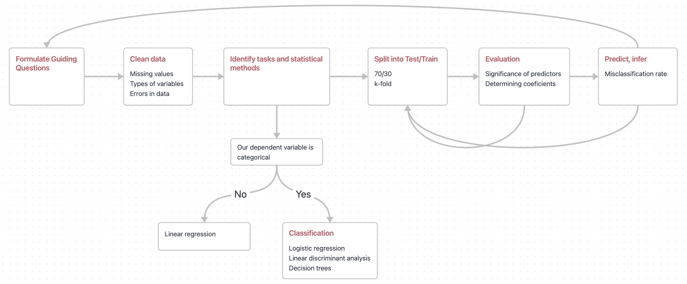

```{r setup, include=FALSE}
knitr::opts_chunk$set(echo = TRUE)
library(survey) #Used for statistical analysis
library(sampling) #Used for sample data
library(ggplot2) #Used for plot
library(tibble) #used for nice display dataframe
library(magrittr) #Used for %>% 
library(tidyverse) #Used to manipualte dataframe
library(dplyr) # Used for easy manipualte rows and columns
library(plyr) #Used for mapping vector values
library(stringr) #Used to manipulate string
```


\pagebreak

# Introduction

Mobile phones are everywhere, so are the prices. Despite still having the word "phone" in the name, a typical modern smartphone has much more features than just to make and receive calls. They are boasting a staggering range of applications like brand, memory, storage, camera, resolution, just to name a few. All these cutting edge technology and features packed in one little device does not come without a cost. A [2020 review](https://www.thisismoney.co.uk/money/bills/article-8548235/High-end-mobile-phones-price-soared-490-20-years.html) of premium mobile phones shows a staggering _490%_ rise in the last two decades.

With so many mobile phones on the market, it can be difficult to decide which one you want to buy. As a customer, we are particularly interested in finding some relation between all these features and its selling price. To this purpose, we collected the [MobilePhone's dataset](https://www.kaggle.com/datasets/sudhanshuy17/mobilephone) from Kaggle and apply a set of statistical analysis hoping to answer some guiding questions:

1. Can we estimate the average price for mobile phones?
2. What is the impact of each mobile phone's feature on the selling price?
3. Can a classification model to distinguish the selling price range?
3. Can we build a decent model to predict the selling price for a mobile phone?


# Dataset

The initial dataset consists of 8 columns and 28,036 rows and no missing values. These 8 columns are:

* **Model**: categorical variables with sub-classes. These names include the color of the unit
and its storage capacity. The latter being also listed as a separate column. - **Independent Variable**
* **Company**: categorical variable. Name of the phone's manufacturer. - **Independent Variable**
* **Price**: continuous variable. Units in Indian Rupees. - **Dependent Variable**
* **Rating**: continuous variable. Units in Indian Rupees. - **Independent Variable**
* **Number of ratings**: discrete variable: a simple count. - **Independent Variable**
* **Total reviews**: discrete variable: a simple count. - **Independent Variable**
* **RAM size**: categorical variable. RAM specification of the phone. - **Independent Variable**
* **ROM size**: categorical variable. Storage (non-volatile memory) capacity of the phone. - **Independent Variable**

Some initial steps can be completed to clean the dataset and create new variables which can be used in our analysis. The initial steps for cleaning the dataset are as follows:

1. Remove any duplicates in the dataset;
2. Because **Model** column contains sub-class of a mobile phone, we decide to further break it down to _Model_ and _Color_;
3. Add additional column to segment the **Price** into 4 different levels.

After cleaning and breaking down columns, the dataset now consists of 11 columns and 736 rows and no missing values. These 11 columns are:

* **Model**: categorical variables with sub-classes. These names include the color of the unit
and its storage capacity. The latter being also listed as a separate column. - **Independent Variable**
* **Company**: categorical variable. Name of the phone's manufacturer. - **Independent Variable**
* **Price**: continuous variable. Units in Indian Rupees. - **Dependent Variable**
* **Rating**: continuous variable. Units in Indian Rupees. - **Independent Variable**
* **Number of ratings**: discrete variable: a simple count. - **Independent Variable**
* **Total reviews**: discrete variable: a simple count. - **Independent Variable**
* **RAM size**: categorical variable. RAM specification of the phone. - **Independent Variable**
* **ROM size**: categorical variable. Storage (non-volatile memory) capacity of the phone. - **Independent Variable**
* **aug_model**: categorical variable. It only contains the Model information for a mobile phone. - **Independent Variable**
* **aug_color**: categorical variable. The color of a mobile phone. - **Independent Variable**
* **aug_price**: categorical variable. The price level of a mobile phone, with levels of "Low", "Medium", "High", "Very High" - **Independent Variable**

```{r 2.1 Load Data}
mobile_dataset <- as_tibble(read.csv("./augmented_dataset.csv"))
mobile_dataset %>% head(4)
```
The dataset and detailed analysis can be found at this [repository](https://github.com/YongpengFu/Statistical-Model-for-Mobile-Phones). 

# Scope of Analysis

Our team is finalizing what the full analysis of the dataset will look like, but a preliminary template and breakdown of work by team member has been included below. The different colors represent which components of the project different team members would take on. It is anticipated that all members will assist in the finalization of the report.


\pagebreak

# References

2020 review. “High-End Mobile Phones Price Have Soared 490% in 20 Years | This Is Money.” This Is Money, This Is Money, 23 July 2020, https://www.thisismoney.co.uk/money/bills/article-8548235/High-end-mobile-phones-price-soared-490-20-years.html.  

MobilePhone's dataset. “MobilePhone’s Dataset | Kaggle.” Kaggle: Your Machine Learning and Data Science Community, Kaggle, 20 Dec. 2022, https://www.kaggle.com/datasets/sudhanshuy17/mobilephone.
