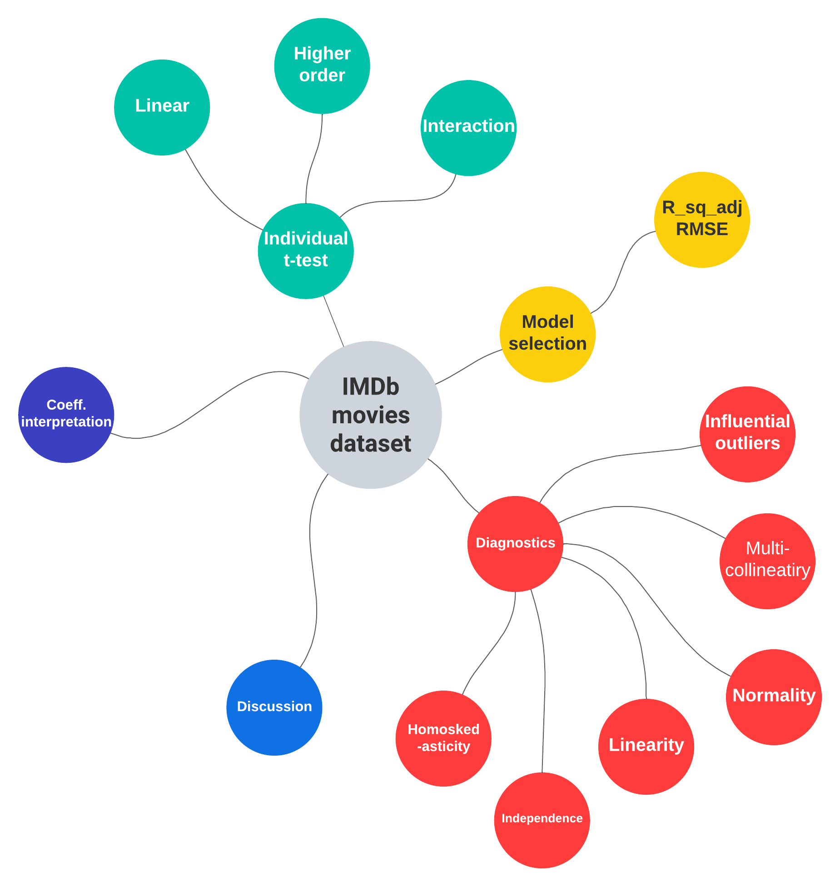

```{r setup, include=FALSE}
knitr::opts_chunk$set(echo = TRUE)
library(survey)
library(sampling)
library(ggplot2)
library(tibble)
library(magrittr)
```


\pagebreak

# Chapter 1: Introduction

Mobile phones are everywhere, so are the prices. Despite still having the word "phone" in the name, a typical modern smartphone has much more features than just to make and receive calls. They are boasting a staggering range of features, like brand, memory, storage, camera, resolution, just to name a few. And as you can imagine, with all this new technology and features jam packed in one little device costs money, costs a lot of money. A [2020 review](https://www.thisismoney.co.uk/money/bills/article-8548235/High-end-mobile-phones-price-soared-490-20-years.html) of premium mobile phones shows a staggering _490%_ rise in the last two decades.

With so many mobile phones on the market, it can be difficult to decide which one you want to buy. As a customer, we are particularly interested in finding some relation between all these features and its selling price. To this purpose, we collected the [MobilePhone's dataset](https://www.kaggle.com/datasets/sudhanshuy17/mobilephone) from Kaggle and apply a set of statistical analysis hoping to answer some guiding questions:

1. Can we estimate the true average price for mobile phones?
2. What is the impact of each mobile phone's feature on the selling price?
3. Can a classification model to distinguish the selling price range?
3. Can we build a decent model to predict the selling price for a mobile phone?


# Chapter 2: Dataset and Scope of Analysis.

We chose a dataset weighting by *simplicity*. That is, we would like to maximize the learning experience applying class content to a toy/stylized modelthat may or may not have any practical use.

## Dataset

The dataset consists of 8 columns and 28'036 rows and no missing values.

* *Model*: categorical variables with sub-classes. These names include the color of the unit
and its storage capacity. The latter being also listed as a separate column.
* *Company*: categorical variable. Name of the phone's manufacturer.
* *Price*: continuous variable. Units in Indian Rupees.
* *Rating*: continuous variable. Units in Indian Rupees.
* *Number of ratings*: discrete variable: a simple count.
* *Total reviews*: discrete variable: a simple count.
* *RAM size*: categorical variable. RAM specification of the phone.
* *ROM size*: categorical variable. Storage (non-volatile memory) capacity of the phone.

## Scope of Analysis

TODO: Hash out modelling. I recommend a diagram using a tool like lucidcharts.com. 
See the templates section. For instance (see Figure 1 below).



The dataset and detailed analysis can be found at this [repository](https://github.com/YongpengFu/Statistical-Model-for-Mobile-Phones). 


# Chapter 5: References

TODO
